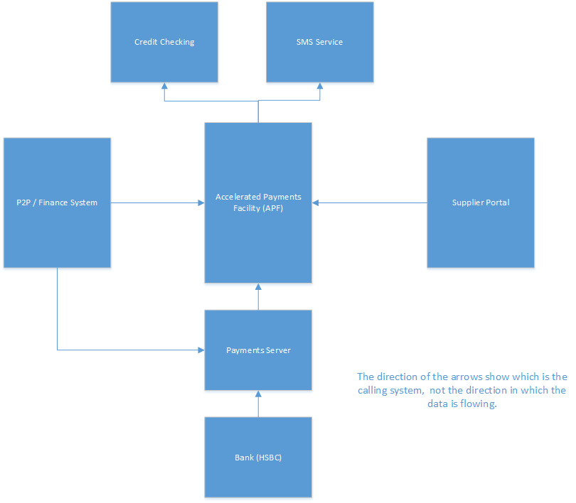

# Overview
The Accelerated Payments Facility (APF) is a self-contained “micro service” which sits between a number of systems as shown in the diagram below.



# P2P to APF
# Finance System to Payments Server
This document can be used along with the sample C# program:
	PROACTIS.AcceleratedPayments.Web.ExampleBuyerAPIClient


 

This document is only concerned with the integrations between the Finance System and the Payments Server.
Currently there is only one integration between these two systems which is the flow of supplier details from the finance system to the payment server.
 
 
### Authentication
All API calls require the username and password be supplied in a base64 encoded format in the Authorisation header of the request.
In C# the code for doing this would look like the following:
```C#
credentials = Convert.ToBase64String(Encoding.UTF8.GetBytes(USER + ":" + PASSWORD));
client.DefaultRequestHeaders.Add("Authorization", "Basic " + credentials);
```
For example
 

If the details are incorrect then the site will respond with a 401 error
 

From https://en.wikipedia.org/wiki/Basic_access_authentication
When the user agent wants to send the server authentication credentials it may use the Authorization field.
The Authorization field is constructed as follows: 
1.	The username and password are combined with a single colon.

# Finance System to APF
# APF to 3rd Party Portal
