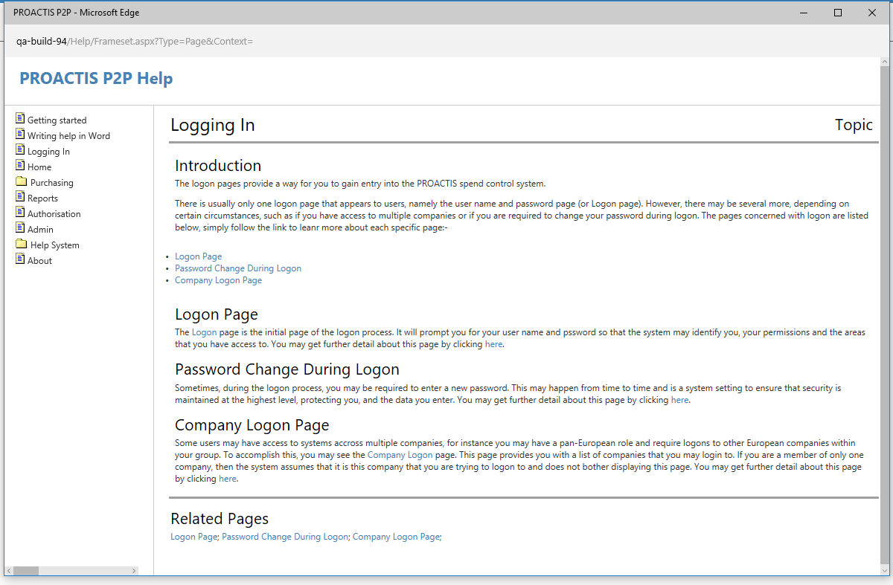
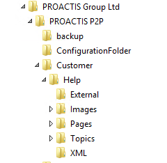
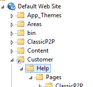

# Online Help

PROACTIS online help, is a mechanism for bundling help with the PROACTIS application, help that is relevant to what the user is currently doing. The user gets to the online help through the help button, located at the top right of each web page (as shown below).


In order for the help button to be display,  the following setting needs to be added to the **Application Configuration** settings.


By selecting the help button, they are presented with a pop-up help window that defaults to the context of the page from where the user called it. This is called context sensitive help, help which is sensitive to the current page. The other form of help is topical help. The topics may be seen in the left hand pane of the help window (see below), and usually relate to tasks as a whole rather than specific pages, such as creating a purchase order.



## Location of Help Files
Help files can exists in one of two locations within the PROACTIS Web Site.

* The Help Directory within the main site (normally *C:\Program Files (x86)\PROACTIS Group Ltd\PROACTIS P2P\website\Help*)
* The Help Directory within the customer folder. (normally *C:\Program Files (x86)\PROACTIS Group Ltd\PROACTIS P2P\Customer\Help*)

By default PROACTIS is installed with a very basic help sample within the core product and no customer directory defined. It is strongly recommended that any site developing their own user defined help create a help directory within the customer folder as this will enable upgrading of PROACTIS without any reconfiguration of the help system.

When PROACTIS initialises it checks whether a help folder exists within the customer area of the web site. If it does it looks in this location for help topics otherwise it default to the help folder contained within the current build folder.

If a Help directory does not exist within the customer area the simplest way to create one is to copy the structure from the help directory within the main site. 

1. On the application server create a new folder called *Customer* within the **C:\Program Files (x86)\PROACTIS Group Ltd\PROACTIS P2P** folder.
2. Into this new folder copy the entire help folder from **C:\Program Files (x86)\PROACTIS Group Ltd\PROACTIS P2P\website**
3. Within IIS,  add the customer folder as a virtual folder called **Customer** within the main website.


*Windows Folder Structure*


*IIS Structure*

### Important File
Two important files are found within the XML folder 
* TOC.XML
* ExternalContext.XML

These are edited by administrators to provide the links to the files that they have written and stored in the external directory.

### Creating Help Topics

These can be created in any editor WORD etc. and saved within the **Customer\Help\External** directory.

Files can be saved in multiple formats (HTML, Word .Doc , PDF ) although perhaps the easiest to manage are the .MHT files that can be saved from later versions of Microsoft Word. This creates a single web file that contains any graphics etc used within the document


### TOC Entries
This file holds a listing of topics and a link to the appropriate help contents. It supports both the original help and the new simplified help documented here.

EXAMPLE HERE

Help topics can be indented / embedded in a hierarchical structure as shown below.
 
```xml
	<grs:HelpTopic…….>
		<grs:HelpTopic……./>
		<grs:HelpTopic……./>
	</grs:HelpTopic>
```

To create a help topic that points to a user defined help topic saved as *HELPINFO.HTM* in the external directory the following format is required.

```xml
<grs:HelpTopic grs:External="True"  grs:DisplayName="New Help Item" grs:ID="HelpInfo.HTM" grs:AltText="Tool tip about the help item."/>
```

### Context Page Entries
The link between pages and help topics are maintained within the **ExternalContext.XML** file.
 
The ID attribute is the name of the user defined help topic saved in the external directory
The ContextPage attribute is the ID of the PROACTIS web site page. This Context Page setting can be identified by 

TODO


---

## Context Sensitive Help
As mentioned above, context sensitive help relates to specific pages, and when the help button is pressed, the help page that is displayed relates to page from which the help was requested. This is controlled through the page name, a unique name that is assigned to each and every web page. The page name may be seen as a comment at the top of the HTML source for each page, by right clicking in any blank area of a PROACTIS webpage, and selecting the view source option from the pop-up menu. An example of this can be seen below:

```html
<!-- Page Name: Home/Logon.asp -->
<html>
    <head>
      ...
```


Using this unique name, the help system looks for a related XML help file, and, if not found, defaults to a file called **NoPageHelp.xml**. This file holds the contents of the default message to be displayed when the proper help file cannot be found in the location specified, or if there is a problem when trying to load it.

Each context sensitive help file is found within the Pages folder beneath the Help subfolder, located just off of the application root folder. Each file is stored in a folder structure that mimics the page folder structure it refers to, and is called by a name that is similar to the page name, except that the help file has an .xml file extension rather than an .asp file extension. So, taking the example above, the help system would be looking for the following help file:

Help/Pages/**Home/Logon.xml**


As discussed, if this file is not a well-formed XML document or is not in the expected location, the default XML file will be used, indicating that there is not help associated with this page.

---

## Topical Help
On the other hand, Topical help refers to more general types of help such as how to create a purchase order, rather than the specifics of a single page. Topical help is navigated and governed by the TOC (Table Of Contents), which can be seen in the left hand pane when viewing the help window. The TOC appears as a tree list (see figure 2) with each topic described as a link, or anchor, to the desired topic. 

As with context sensitive help, if the specific help file is not a well-formed XML document or could not be found in the location specified, then the help system defaults to **NoTopicHelp.xml** file for its content.

As with context sensitive help, an ID refers to each help topic, and it is this ID that is used to load the associated help file. For instance, a help topic with an ID of ‘LoggingIn’ would have an associated topic file called **LoggingIn.xml**. These topic files are grouped together under a common folder called Topics, which is located within the Help subfolder. It is possible to group like topics under the same folder to make the help files easier to manage. For instance, suppose you have the following topical help files:

+ Logon
+ ChangeUserPassword
+ LogonCompany


You might want to group these as into a folder that best reflects the subject that they are talking about, a folder called, say, LoggingIn. By doing this it important to adjust your ID to reflect the new folder grouping. So, in our example above, we have three folder topics, each representing a topical help ID of the same type of task, namely logging in, and these may then be grouped into a folder called LoggingIn. With all of this information, our topical help ID’s will be:

+ LoggingIn/Logon
+ LoggingIn/ChangeUserPassword
+ LoggingIn/LogonCompany
 

The folders and file names of our files would be:

+ Help/Topics/LoggingIn/**Logon.xml**
+ Help/Topics/LoggingIn/**ChangeUserPassword.xml**
+ Help/Topics/LoggingIn/**LogonCompany.xml**

---

## The TOC (Table Of Contents)

### What is the TOC?

The TOC, or table of contents, is an XML file that contains a reference to each topical help file, and how it relates to the topics around it, i.e. who it’s parent topics are, and who it’s child topics are. It’s worth noting that the TOC does NOT relate to any pages, i.e. context help; it only provides access to the topics. For more information about context help and topical help, see the sections above. An example of the TOC can be seen below (figure 3):

PICTURE

This TOC gives rise to the tree-view type of structure that can be seen on the left hand side in figure 2. You can see, for instance that the topic Creating an order falls under the topic Orders, which itself falls under the topic Purchasing. If you know a little XML, you’ll notice that each **&lt;grs:HelpTopic>** tag relates to a corresponding **&lt;/grs:HelpTopic>** closing tag if it contains any children. If it doesn’t contain any children, it is simply an empty tag; viz. **&lt;grs:HelpTopic />**. 

### How does the TOC work?
The TOC is effectively a container with which to hold and manage the table of contents. As mentioned previously, the structure reflects the hierarchical nature of the data. Each HelpTopic tag holds all the information needed to display the corresponding help topic file. Below is an explanation of each HelpTopic attribute:

### DisplayName
This attribute controls what the user sees for the link in the help window. 

### ID
The ID corresponds to the topic help file. So an ID of Logon would correspond to a help file called ‘Logon.xml’ in the Topic folder located within the Help folder.

### AltText
This is to provide the user with a tool-tip type text pop-up, when they hover their mouse over the link. You may add more descriptive text to the link.

---

## The Help File

### Description
Since we have covered the help mechanism structure, we can now have a closer look at the help file itself, the file that holds the content of the help, the content that the user will see and interact with. As mentioned, each topic and page has its own help file, with the page help files kept in a folder structure that mimics the site structure, and topic help files are kept in user defined folders.

### File Contents
The help files are well-formed XML files. Each file is broken into three distinct sections; Title, Contents, and Related Documents, each of which will be discussed in more detail later. These three sections are all held together with a root element whose purpose is contain these sections, as well as confirm the help Type, ID and namespace. Again, the details of these will be discussed later. Each section in turn may contain child elements, links and paragraphs, for instance. Below, is an outline of a help file document, and with its sections displayed:

```xml
<?xml version=”1.0”?>
<grs:Help>
    <grs:Title>
    <grs:Content>
    <grs:RelatedDocuments>
</grs:Help>
```

### File Sections
In this part of the document, I’ll be discussing the various sections and how they fit together. I was contemplating which order to discuss each element, or section, in the order that they appear, or alphabetically, and have decided on alphabetically. 

It is also important to discuss some notation. All values surrounded by double chevrons (<< >>) indicate actual values. Where shown, these actual values are case sensitive, so &lt;&lt;yes>> is not the same as &lt;&lt;Yes>> since the second value begins with a capital letter. Where there are two or more possible values, they are separated by a vertical bar (|), indicating an or possibility, for instance &lt;&lt;yes>> | &lt;&lt;no>> would be indicating possible values of ‘yes’ or ‘no’ only. If one of these values acts as a default value, i.e. if no value is entered this value is assumed, it would look like this, where the value &lt;&lt;no>> is the default value;  &lt;&lt;yes>> | default &lt;&lt;no>>. 

So, armed with this information, let’s take a look at each element in alphabetical order.

---

## grs:Content

The **&lt;grs:Content>** element defines the content that the user sees in the right hand pane of the help screen, barring the title at the top and the related documents at the bottom. It has no attributes and merely acts as a container for various formatting elements, such as the **&lt;grs:Paragraph>** element. 

### Format
```xml
<grs:Content>
</grs:Content>
```

### Position
**&lt;grs:Content>** element always appears as a child of the **&lt;grs:Help>** root element. It only ever appears once within the help document and usually contains numerous child elements.

### Content
The following child elements are permissible in any order, and with any amount of occurrences, but never any text:

```xml
<grs:Image>
<grs:List>
<grs:Note>
<grs:Paragraph>
```

### Attributes
None, the **&lt;grs:Content>** element contains no attributes.

---

## grs:Help

The **&lt;grs:Help>** element is the outermost element of the help file, and is also known as the root element. It contains a reference to the type of help that this file reflects and the ID of the help that it corresponds to. It also contains the Get Real Systems Ltd. namespace declaration, which is outside the scope of this document. However, the Get Real Systems Ltd. namespace declaration looks like this: **xmlns:grs=”http://www.getrealsystems.com/xml/xml-ns”**

### Format
```xml 
<grs:Help 
    grs:Type=help document type
    grs:ID=identifier
    xmlns:grs=”http://www.getrealsystems.com/xml/xml-ns” >
</grs:Help>
```

### Position
**&lt;grs:Help>** element always appears as the outermost element of every help file. In other words, there are no other elements that appear outside this element, other than the XML processing instruction, which is outside the scope of this document. An example of the processing instruction can be seen below:

```xml
<?xml version=”1.0”?>
```

### Content
The **&lt;grs:Help>** element is allowed one each of the following child elements, but never any text:

```xml
<grs:Title>
<grs:Content>
<grs:RelatedDocuments>
```
 
### Attributes
| Name | Value | Meaning |
|------|-------|---------|
grs:Type (mandatory) | << Page >> &#124; << Topic >> | Sets the type of help file. Since help files can be categorised into two distinct types, only one of these types is permissable. |
grs:ID (mandatory) | string | This attribute would correspond to the help topic ID or the page ID (name) to which this help file refers. |
 
---

## grs:Image
 
The **&lt;grs:Image>** element is classed as a formatting element, in that it describes the content and how it is shown. It is intended to be used to show illustrations, such as screen shots, embedding them within the help file. It has no child elements, and no text nodes, in other words it must me an empty element.

### Format
```xml
<grs:Image 
    grs:AltText=mouse over text
    grs:Border=image border
    grs:Caption=image caption
    grs:Source=image file location/>
```
 
### Position
**&lt;grs:Image>** element always appears as a child of the **&lt;grs:Content>** element, in any order and any amount of times.

### Content
None, the **&lt;grs:Image>** element never contains any child elements nor any text.

### Attributes

| Name | Value | Meaning |
|------|-------|---------|
grs:AltText (optional) |  string |  Sets the image tool-tip text. This is visible when the user holds their cursor over the image. |
grs:Border (optional) |  &lt;&lt;yes>> &#124; default &lt;&lt;no>> | If set, sets a 1 pixel width black border around the image. |
grs:Caption (optional) | string | If entered, sets an italicised caption underneath the picture.  |
grs:Source (mandatory) | string | The location of the image file, including the image name. Is always with respect to the Help  |folder within the Images subfolder located beneath the application root. |
 
---

## grs:Link
 
This element allows the user to provide a link to either a page help document, a topic help document or an external link using the HTML standard anchor format. If the link type is set to either **&lt;&lt;page>>** or **&lt;&lt;topic>>** then the grs:ID attribute is used to construct the Help system’s custom hyperlinks, otherwise if the link type is set to **&lt;&lt;external>>** then the grs:HREF attribute is used to construct a standard HTML hyperlink.

### Format
```xml
<grs:Link 
    grs:AltText=mouse over text
    grs:DisplayName=link text name
    grs:ID=page or topic ID
    grs:HREF=HTML anchor format HREF
    grs:Type=link type />
```
 
### Position
**&lt;grs:Link>** element may appear multiple times as a child of a the following:

```xml
<grs:Paragraph>
<grs:ListEntry>
<grs:Note>
<grs:RelatedDocuments>
```
  
### Content
None, the **&lt;grs:Link>** element is an empty element and may contain no child elements nor text.

### Attributes
| Name | Value | Meaning |
|------|-------|---------|
grs:AltText (optional) | string | Sets the link’s tool-tip text. This is visible when the user holds their cursor over the link.
grs:DisplayName (mandatory) | string | Sets the text of the hyperlink, the display name.
grs:HREF (mandatory) | string | Only mandatory when the grs:Type is set to **&lt;&lt;external>>**. When used, sets up the HTML anchor tag HREF attribute to create a standard anchor tag.
grs:ID (mandatory) | string | Only mandatory when the grs:Type is set to **&lt;&lt;page>>** &#124; **&lt;&lt;topic>>**. When used, sets up the HTML anchor tag HREF attribute to create a help system specific anchor tag.
grs:Type (mandatory) | &lt;&lt;external>> &#124; &lt;&lt;page>> &#124; &lt;&lt;topic>> |  Defines the type of the link. Both **&lt;&lt;page>>** and **&lt;&lt;topic>>** are used make the help application create Help system tags, while the **&lt;&lt;external>>** option creates a standard HTML anchor tag.
 
---

## grs:List

The **&lt;grs:List>** element is considered to be a formatting type element, in that it appears as a child element within the **&lt;grs:Content>** element, and describes the way that the content appears to the user. Its purpose is to provide either a bulleted or numbered list. The list gets converted into an HTML unordered, or bulleted, list (&lt;UL>) or ordered, or numbered, list (&lt;OL>).

### Format

```xml
<grs:List 
    grs:Type=list type >
</grs:List>
```

### Position
**&lt;grs:List>** element appears always as a child of the **&lt;grs:Content>** element, in any order and any amount of times.

### Content
Only the **&lt;grs:ListEntry>** element is allowed as a child of the **&lt;grs:List>** element, and no text.

### Attributes
| Name | Value | Meaning |
|------|-------|---------|
grs:Type (mandatory) | &lt;&lt;bullet>> &#124; &lt;&lt;number>> | Sets the type of list, either bulleted or numbered.
 
---

## grs:ListEntry
 
**&lt;grs:ListEntry>** element describes each point in a list, and is classed as a formatting element. There is a separate element per point in the list, with each **&lt;grs:ListEntry>** being converted into an individual HTML list item (&lt;LI>). 

### Format
```xml
<grs:ListEntry>
</grs:ListEntry>
```
 
### Position
**&lt;grs:ListEntry>** element must be a child of **&lt;grs:List>** element only.

### Content
May contain multiple occurrences of the following:
```xml
<grs:Link>
Text
```

### Attributes
None, the **&lt;grs:ListEntry>** element has no attributes.

---

## grs:Note

The **&lt;grs:Note>** element is classed as a formatting element, and is converted to the word ‘Note’ underlined and in italics, followed by a hyphen then the text of the note, thus:

_Note_ – The text of the element goes here.

### Format
```xml
<grs:Note>
</grs:Note>
```

### Position
The **&lt;grs:Note>** element always appears as a child of the **&lt;grs:Content>** element.

### Content
May contain multiple occurrences of the following:
```xml
<grs:Link>
Text
```

### Attributes
None, the **&lt;grs:Note>** element has no attributes.

---

## grs:Paragraph

This element is classed as a formatting element, and describes a paragraph within the help content. It may have a heading or not, and it may contain text and links, or just text or just links.

### Format
```xml
<grs:Paragraph 
    grs:Title=paragraph title >
</grs:Paragraph>
```

### Position
Always appears as a child of the **&lt;grs:Content>** element, in any order, and any amount of times.

### Content
May contain multiple occurrences of the following:
```xml
<grs:Link>
Text
```
 
### Attributes
| Name | Value | Meaning |
|------|-------|---------|
grs:Title (optional) | string | If present, creates a title for the paragraph in bold.

---

## grs:RelatedDocuments

**&lt;grs:RelatedDocuments>** element provides a standardised way for the Help system developer to link topics and pages together and provide links to external documents. All links appearing as children to this element appear at the very bottom of the help content page, divided into three groups:

1. Related Pages
2. Related Topics
3. Related Links

### Format
```xml
<grs:RelatedDocuments>
</grs:RelatedDocuments>
```
 
### Position
**&lt;grs:RelatedDocuments>** element only appears as child of the **&lt;grs:Help>** element, and only ever appears once.

### Content
May contain any number of **&lt;grs:Link>** elements.

### Attributes
None, the **&lt;grs:RelatedDocuments>** element contains no attributes.
