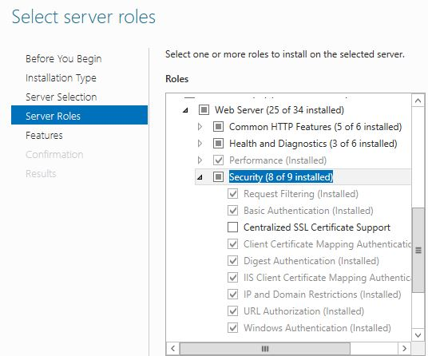
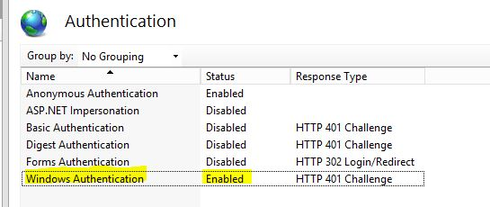

# P2P Single-Sign-On (SSO)
By default PROACTIS expects the users to enter their username and password in order to login into PROACTIS P2P.   This document lists the possible ways in which PROACTIS P2P can be configured to allow users to authenticate using Single-Sign-On.

!!! Notes
    If you wish your users to use a combination of PROACTIS and SSO logins then add the following setting to the __ApplicationConfiguration.xml__ file.
    ```xml
    <Setting Name="AllowPROACTISLogins">True</Setting>
    ```

---

## Windows Authentication
If your PROACTIS P2P server is on the same domain as your users then the system can be configured so that they are automatically signed on without the need for them to re-enter their username and password.

+ Ensure that Windows Authentication is enabled in IIS for your PROACTIS website

It must first be installed as part of the __Web Server__ role. 



And then enabled in the authentication section of your website



!!! Note
    If some of your users aren't on your domain,  then leave anonymous authentication enabled for them.

    + Add the following setting to the __ApplicationConfiguration.xml__ file.
    ```xml
    <Setting Name="AuthenticationMethod">WINDOWS</Setting>
    ```
    
+ Set the __NTLogon__ flag to True against the users,  and ensure that their usernames are in the format DOMAIN\Username.  _For example PROACTIS\DavidBetteridge_

---

## SAML2
PROACTIS P2P has built in support for SSO using the industry standard [SAML2](https://en.wikipedia.org/wiki/SAML_2.0) protocol.

+ First generate (or obtain) a local certificate and provide the public part of this to your identity provider.
```batch
makecert -r -pe -n "CN=your_cert_name" -sky exchange -sv mycert.pvk mycert.cer

Enter yourPassword for the subject key (3 times!)

pvk2pfx.exe -pvk mycert.pvk -spc mycert.cer  -pi yourPassword -pfx mycert.pfx -po yourPassword
```


+ With in your website's customer folder create a file called __saml.config__.   This should be based on the following template.


```xml
<?xml version="1.0"?>
<SAMLConfiguration xmlns="urn:componentspace:SAML:2.0:configuration">
   <ServiceProvider Name="service-provider-name"
                    AssertionConsumerServiceUrl="~/SystemLogon/AssertionConsumerService"
                    LocalCertificateFile="path-to-local-certificate-file"
                    LocalCertificatePassword="local-certificate-password"/>
 
 
   <!-- ADFS -->
   <PartnerIdentityProviders>
      <PartnerIdentityProvider Name="partner-identity-provider-name"
                Description="PROACTIS AD"
                               SignAuthnRequest="false"
                               WantSAMLResponseSigned="false"
                               WantAssertionSigned="true"
                               WantAssertionEncrypted="true"
                               PartnerCertificateFile="path-to-partner-certificate-file"
                               ClockSkew="00:03:00"
                               SingleSignOnServiceUrl="single-sign-on-service-url"/>
   </PartnerIdentityProviders>
 
</SAMLConfiguration>
```

+ Add the following settings to your application.configuration file
```xml
<Setting Name="SSOAttributeName">NameID</Setting>
```
The name of the attribute containing the user identifier in the attributes list returned from the ADFS server.
If not specified then no attribute lookup is made and user identification is based on the “username” returned from the ADFS server.
 
```xml
<Setting Name="SSOAttributeNameMask"></Setting>
```
An optional mask to be applied to the above user identifier value.
 
```xml
<Setting Name="SSOMatchP2PUserOnEmailAddress">False</Setting>
```
By default, P2P searches the database Users table to find a user whose “LoginID” matches the identifier value returned from the ADFS server.
This optional setting will cause the lookup to be made on “EmailAddress” rather than “LoginID”
 
```xml
<Setting Name="SSODatabaseTitle"></Setting>
```
An optional setting that only applies when a user who is already logged into a 3rd party system, initiates a logon to P2P via SSO. In this scenario, the user is not 
presented with a logon page. If the user has access to multiple databases, then this setting specifies the database title (in the database xml file) to log into.
If this setting is not present, P2P will select the default database in the databases xml file (or the first database if no default).
Obviously if only one database is available, then this setting is unnecessary.

---

## External
By default PROACTIS P2P validates the username and password entered by the user against the record in the __dsdba.Users__ table.   It is however possible to customise PROACTIS so that users are validated against an external userstore such as LDAP.

The following steps should be followed in order to create an external validation DLL.

+ Create a new C# class library with a class called __Services__ which implements the __ILogin__ interface.  This interface can be found in __PROACTIS.P2P.grsCustInterfaces.DLL__

+ Decide if your login process will be called asynchronously or not and implement the UseAsynchronousImplementation as required.

```C#
    public bool UseAsynchronousImplementation => false;
```
+ Implement the __Login__ (or __LoginAsync__) method with your custom validation code.  This method should return True for a successful login and False for a failure.  (For security reasons it is not possible to return messages informing the user why the login failed.  For example _the username does not exist_)

+ Compile your code,  and ensure that the resulting DLL is named xyzLogin.DLL.   (xyz can be anything)

+ Copy the DLL into your __PROACTIS P2P/Plugins__  (or __Plugins/[database-title]__) folder.

+ Add the following setting into your __applicationconfiguration.xml__ file.
```xml
<Setting Name="AuthenticationMethod">EXTERNAL</Setting>
```

See the [PROACTIS.ExampleApplications.ExternalLogin](https://github.com/proactis-documentation/ExampleApplications/tree/master/P2P/SSO/PROACTIS.ExampleApplications.ExternalLogin) example application for a complete sample implementation.

!!! Notes
    - In order to login using the external DLL,  the user must have their NTLogon property set to True
    - Failed login attempts aren't recorded

---

## Bespoke
It is also possible to provide your users with a completely custom login process,  including replacing the login screen and adding the ability to automatically create users the first time they connect.
